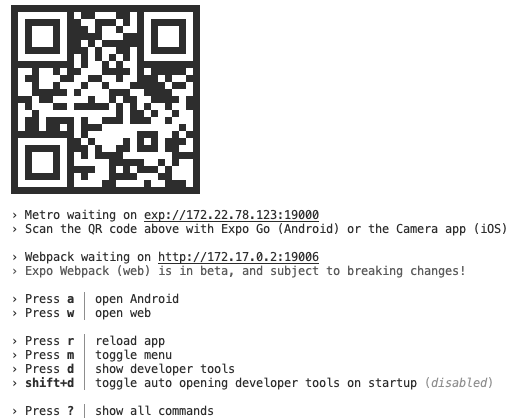

# nblocks-react-native
This is currently a hello world react native app that gradually includes more and more functionality from nblocks. The idea is to turn this project into a ui plugin published and installable with `npm`,  just like `nblocks-ionic`. 

## Built with Expo
Following the recommended way to get started with react-native nowadays this project is built with `expo`. Expo is a set of tools built around React Native to easily build, run and deploy your app. It also simplifies working with native OS APIs. Since this project aim to be an installable plugin, not deployable itself and available to as many react-native devs as possible, expo will probably be removed later on.

Initial commands used:
1. `expo init nblocks-react-native --npm`
1. Picking blank typescript project

### Documentation
* [Expo](https://docs.expo.dev)
* [React Native](https://reactnative.dev/)

## Run it
When starting the development server web browsers and mobiles (Expo Go) can access the app using QR code. Due to the project beeing inside a docker container external access outside the host machine requires the local IP to be set.

`REACT_NATIVE_PACKAGER_HOSTNAME=[YOUR_LOCAL_IP] npm run start`

## Keeping dependencies up-to-date
* `expo upgrade` will upgrade expo sdk and also npm packages to compatable semver.
* `npm install -g expo-cli` to keep global expo cli up-to-date

(`npx react-native upgrade` when we've diched expo)